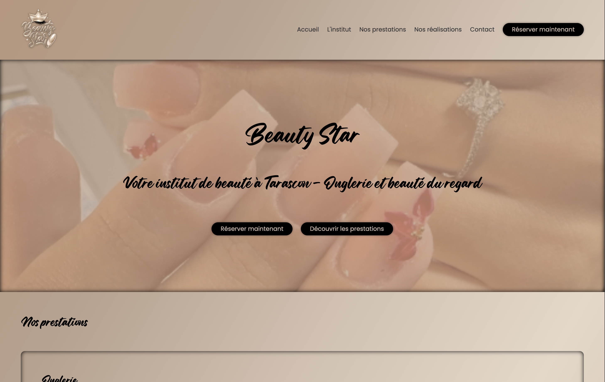
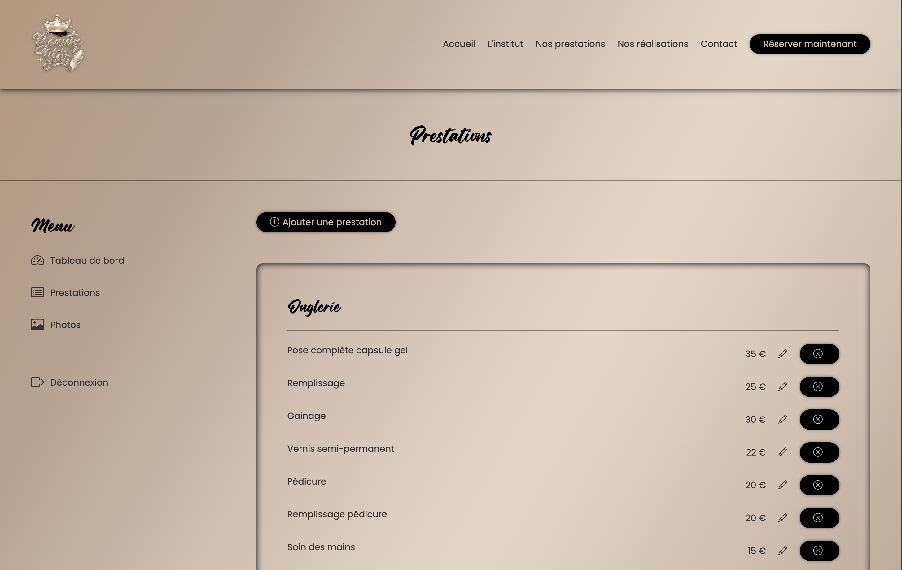
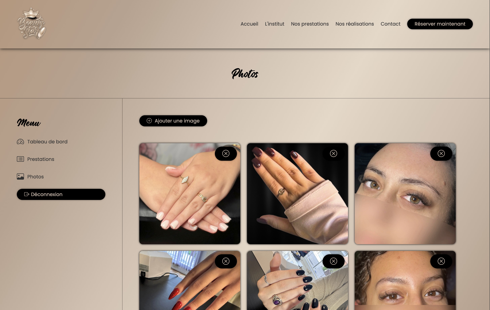

<div align="center">


### Application Web pour un institut de beauté


  


 


[](https://beautystar.onrender.com)

</div>

---

## ✨ À propos du projet

**Beauty Star** est une application web développée pour un institut de beauté, permettant de présenter les prestations et de gérer dynamiquement le contenu via une interface d’administration sécurisée.

Ce projet met en avant nos compétences en **développement backend avec Flask**, en **gestion de base de données**, ainsi qu’en **création d’applications web complètes orientées métier**.

---

## 🎯 Objectifs

* Créer un site vitrine dynamique connecté à une base de données
* Mettre en place une interface administrateur sécurisée
* Gérer du contenu (prestations, images) via un back-office
* Structurer une application Flask complète et maintenable

---

## 🧠 Approche technique

Ce projet a été développé avec une attention particulière sur :

* 🔐 **Authentification sécurisée des utilisateurs**
* 🧩 **Architecture backend structurée**
* 🗄️ **Gestion de base de données avec ORM**
* 📂 **Upload et gestion de fichiers**
* 💬 **Feedback utilisateur (messages flash)**

---

## 🛠️ Stack technique

### Backend

* Python3
* Flask
* SQLAlchemy
* Flask-Login

### Frontend

* HTML5 (Jinja2)
* CSS3

### Fonctionnalités backend

* Authentification utilisateur (login/logout)
* CRUD complet des prestations
* Upload et suppression d’images
* Gestion dynamique du contenu

### Outils

* Git / GitHub
* VS Code
* dotenv (gestion des variables d’environnement)

---

## ⚡ Fonctionnalités

* Interface publique dynamique (prestations + galerie)
* Back-office administrateur sécurisé
* Ajout / modification / suppression de prestations
* Upload d’images avec validation
* Gestion des erreurs et messages utilisateurs
* Organisation claire du projet

---

## 🔒 Sécurité

* Hash des mots de passe avec `werkzeug.security`
* Authentification avec Flask-Login
* Protection des routes sensibles (`login_required`)
* Validation des fichiers uploadés

---

## 📸 Aperçu





---

## 🚀 Lancer le projet en local

1. Cloner le repository

```bash
git clone https://github.com/ton-repo/beauty-star.git
cd beauty-star
```

2. Créer un environnement virtuel

```bash
python -m venv venv
source venv/bin/activate
```

3. Installer les dépendances

```bash
pip install -r requirements.txt
```

4. Configurer les variables d’environnement

```bash
SECRET_KEY=your_secret_key
DB_PATH=sqlite:///database.db
```

5. Lancer l’application

```bash
python app.py
```

---

## 💼 Auteur

Projet développé par **Priscilla MEZOUAR**

[](https://pmezouar.github.io) [](https://linkedin.com/in/pmezouar) [](mailto:mezouar.priscilla@gmail.com)

Agence **OlysWeb**

[](https://olysweb.com) [](https://linkedin.com/company/olysweb) [](mailto:contact@olysweb.com)

---

⭐ Merci pour votre visite. N'hésitez pas à laisser une étoile si ce projet vous a plu.